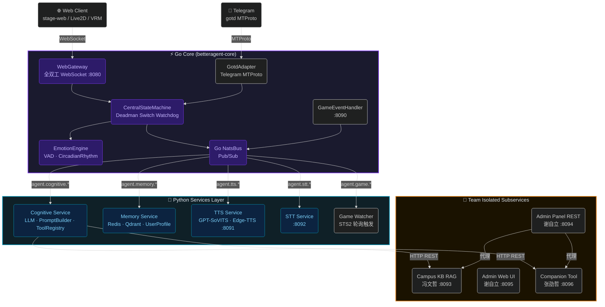

<picture>
  <source
    width="100%"
    srcset="./docs/images/banner-dark.svg"
    media="(prefers-color-scheme: dark)"
  />
  <source
    width="100%"
    srcset="./docs/images/banner-light.svg"
    media="(prefers-color-scheme: light), (prefers-color-scheme: no-preference)"
  />
  
</picture>

<h1 align="center">BetterAgent</h1>

<p align="center">全双工多模态数字人陪伴系统 · Full-Duplex Digital Human Companion System</p>

<p align="center">
  <a href="https://github.com/hpkm2635/BetterAgent/blob/main/LICENSE"></a>
  
  
  
  
  
</p>

<p align="center">
  
  
  
  
</p>

---

> 深受 [Project AIRI](https://github.com/moeru-ai/airi) 启发，致力于构建开放、可本地部署、能与用户双向共情的数字人陪伴系统。

> [!TIP]
> **一键拉起所有微服务**（NATS · Go Core · Cognitive · Memory · TTS · STT · Admin · Companion · Game Watcher）：
>
> ```bash
> python runner.py
> ```

> [!WARNING]
> 本项目不与任何加密货币或 NFT 项目关联，请注意甄别相关虚假信息。

> [!NOTE]
> 系统架构、状态机迁移矩阵、NATS Payload Schema 等完整规范见 [`docs/ARCHITECTURE.md`](docs/ARCHITECTURE.md)。
> 多微服务团队接口契约（端口隔离 · HTTP 契约 · PR 门控）见 [`docs/API-CONTRACT.md`](docs/API-CONTRACT.md)。

---

## 为什么是 BetterAgent？

你是否想过拥有一位**能真正与你共情**的数字伙伴——不是 Character.ai 那样的纯文本聊天框，而是一位可以看到你的屏幕、听到你的声音、理解你的情绪状态，并在你打游戏时实时解说的虚拟存在？

BetterAgent 就是这样的系统：

- **全双工音频流**：毫秒级打断（Barge-in），你随时可以打断 AI 说话，无缝切换话题。
- **情绪与生理感知**：基于 Valence / Arousal / Dominance 三维情感模型 + 生物钟衰减，AI 的情绪是真实计算出来的，而非随机扮演。
- **游戏自主感知**：接入杀戮尖塔 2 C# Mod，AI 实时感知游戏状态并做出出牌决策与解说。
- **长期记忆**：Redis 短时缓冲 + Qdrant 向量检索，AI 会"记住"你说过的话。
- **团队微服务架构**：Go Core 高性能控制核 + NATS 消息总线 + Python 认知/记忆/TTS 微服务，横向可扩展。

---

## 核心能力

### 🧠 认知与记忆

- [x] 多 LLM 提供商支持（Gemini · Claude · OpenAI-compatible）
- [x] 结构化 System Prompt 注入（情绪状态 · 生物钟 · 用户画像）
- [x] MCP 工具注册与调用（ToolRegistry）
- [x] Redis 短期记忆缓冲（ShortTermBuffer）
- [x] Qdrant 向量长期记忆（VectorMemoryStore）
- [x] 用户事实画像管理（UserProfileManager）
- [x] Ebbinghaus 记忆衰减整合（MemoryConsolidator）
- [x] TokenBudget 上下文裁剪（TokenBudgetManager）
- [ ] 校园 FAQ 知识库 RAG 集成（WIP）

### 🫀 情绪与生理引擎

- [x] 3D 情感模型（Valence / Arousal / Dominance）
- [x] 生理指标（Energy · SocialBattery · Affection）
- [x] CircadianRhythm 昼夜生物钟衰减
- [x] UrgeEngine 枯燥度触发主动开口
- [x] CentralStateMachine 45 秒 Deadman Switch 自愈看门狗
- [x] 2 小时空闲自动 Evict 会话回收

### 👂 听觉与打断

- [x] 全双工 WebSocket 音频流（Go WebGateway · 端口 8080）
- [x] 毫秒级 Barge-in 打断，基于 `generation_id` 原子代际防护
- [x] 过期音频切片与口型帧自动清空
- [x] STT 语音识别服务（端口 8092）

### 🗣️ 语音合成

- [x] GPT-SoVITS 本地高质量 TTS（端口 8091）
- [x] Edge-TTS 云端 TTS 回退
- [x] 音频切片内嵌 Viseme 时间轴数据（口型同步，前端消费待接入）

### 🎭 数字人前端

- [x] Live2D 模型支持（口型 · 眼神 · 自动眨眼）
- [x] VRM 模型支持（口型 · 眼神 · 自动眨眼）
- [x] 实时音频频谱驱动口型
- [x] Vue 3 + Pinia + VueUse + UnoCSS（基于 AIRI stage-web 框架）

### 🎮 游戏自主感知（杀戮尖塔 2）

- [x] STS2 C# Mod 接入（游戏事件摄入 · 端口 8090）
- [x] 实时游戏状态解析与自动出牌决策
- [x] Game Watcher Service 轮询与触发
- [x] 解说 HUD 叠加

### 🤝 Telegram 对话频道

- [x] Go gotd MTProto 高性能 Telegram 客户端
- [x] 多聊天会话状态隔离
- [x] 人性化延迟与反 Spam 机制

---

## 系统架构



---

## 微服务端口分配

| 端口 | 服务 | 协议 | 负责人 | 状态 |
| :--: | :--- | :--- | :--- | :---: |
| `4222` | NATS Server | TCP Pub/Sub | 核心 (褚裕禄) | ✅ |
| `8080` | Go Core WebGateway | WebSocket | 核心 (褚裕禄) | ✅ |
| `8090` | 游戏事件摄入 | HTTP / WS | 核心 (褚裕禄) | ✅ |
| `8091` | TTS Service | HTTP | 核心 (褚裕禄) | ✅ |
| `8092` | STT Service | HTTP | 核心 (褚裕禄) | ✅ |
| `8093` | **Campus KB RAG** | HTTP REST | 冯文哲 | ✅ |
| `8094` | **Admin Panel REST API** | HTTP REST | 谢自立 | ✅ |
| `8095` | **Admin Web UI** | HTTP Dev | 谢自立 | ✅ |
| `8096` | **Companion Tool Service** | HTTP REST | 张劭哲 | ✅ |

<details>
<summary>各子服务已实现接口摘要</summary>

**Campus KB (`:8093`, `services/campus_kb/`)**
- `GET  /health` — 健康检查
- `POST /api/kb/ingest` — 知识条目向量入库
- `POST /api/kb/search` — 语义相似度检索

**Admin Panel REST (`:8094`, `admin/backend/`)**
- `GET/POST/PATCH/DELETE /api/admin/personas/{id}` — 人设 YAML 全生命周期管理
- `GET/DELETE /api/admin/users/{user_id}` — 用户管理（只读 + 软删除）
- `GET /api/admin/sessions`, `GET /api/admin/sessions/overview` — 会话记录查看
- `GET/DELETE /api/admin/memory/short-term` — 短期记忆管理
- `GET/DELETE /api/admin/memory/long-term/{point_id}` — 长期记忆（Qdrant）管理
- `GET/PUT /api/admin/memory/profile/{user_id}` — 用户事实画像管理
- `GET/POST /api/admin/kb/*` — 校园知识库代理（透传至 `:8093`）
- `GET/POST/DELETE /api/admin/schedules` — 日程提醒管理
- `GET/PATCH /api/admin/config` — 系统配置在线查看与修改

**Admin Web UI (`:8095`, `admin/frontend/`)**
- Vue 3 + Element Plus 独立后台管理界面

**Companion Service (`:8096`, `services/companion/`)**
- `POST /api/companion/stat` — 陪伴统计写入
- `POST/GET/DELETE /api/schedule/*` — 日程 CRUD（APScheduler 到期触发 NATS 推送）
- `POST /api/companion/query` — NL2SQL 陪伴数据自然语言查询
- `GET  /api/companion/recommendations` — 任务推荐（规则引擎）
- `GET/POST/DELETE /api/user_profile/*` — 用户事实画像管理
- `GET  /api/memory/stats` — 记忆统计

</details>

---

## 快速启动

### 1. 环境准备

```bash
# Python 3.10+，创建并激活虚拟环境
python -m venv .venv
.\.venv\Scripts\activate      # Windows
source .venv/bin/activate     # Linux / macOS

pip install -r requirements.txt
```

### 2. 环境变量配置

```bash
cp .env.example .env
# 填充 NATS_USER / NATS_PASSWORD / WEBGATEWAY_TOKEN / REDIS_PASSWORD 等必要密钥
```

### 3. 一键拉起后端微服务矩阵

```bash
python runner.py
```

`runner.py` 自动编排并守护以下进程：NATS Server · Go Core · Cognitive · Memory · TTS · STT · Campus KB · Admin 后端/前端 · Companion · Game Watcher。

### 4. 启动前端数字人 Web UI

```bash
cd frontend
pnpm install
pnpm --filter @proj-airi/stage-web dev
# → 浏览器打开 http://localhost:5173
```

### 5. 运行集成测试

```bash
# 团队 API 契约门控测试（在组员提交 PR 或集成联调前运行）
pytest tests/test_api_contract.py -v
```

---

## 文档索引

| 文档 | 说明 |
| :--- | :--- |
| [`docs/ARCHITECTURE.md`](docs/ARCHITECTURE.md) | 系统总体拓扑、WebGateway 时序图、UML 类图、状态机迁移矩阵、NATS Payload Schema |
| [`docs/API-CONTRACT.md`](docs/API-CONTRACT.md) | 团队多微服务端口隔离规范、HTTP REST 契约、PR 门控检查清单 |
| [`docs/SECURITY.md`](docs/SECURITY.md) | 鉴权环境变量配置与生产环境信任边界清单 |
| [`CHANGELOG.md`](CHANGELOG.md) | 按语义化版本与 Conventional Commits 规范记录的迭代日志 |

---

## 架构图预览

<p align="center">
  
  
</p>
<p align="center">
  
  
</p>

---

## 鸣谢

- **[moeru-ai/airi](https://github.com/moeru-ai/airi)** — 前端数字人框架（stage-web · Live2D · VRM · 通信协议）深度参考来源
- **[gotd/td](https://github.com/gotd/td)** — 高性能 Go Telegram MTProto 客户端
- **[NATS.io](https://nats.io/)** — 超低延迟消息总线，支撑全系统 Pub/Sub 与 JetStream
- **[Qdrant](https://qdrant.tech/)** — 向量数据库，支持语义长期记忆检索
- **[GPT-SoVITS](https://github.com/RVC-Boss/GPT-SoVITS)** — 本地高质量 TTS 语音合成引擎
- **[Mega Crit Games / Slay the Spire 2](https://www.megacrit.com/)** — 游戏感知 Mod 接入参考

