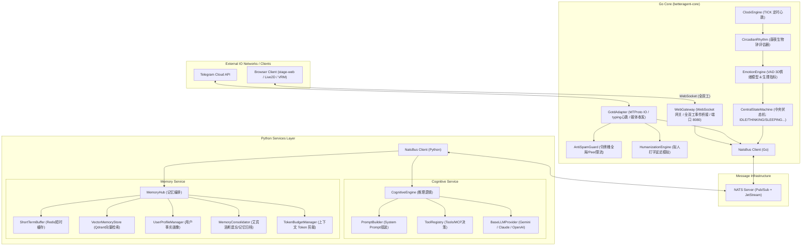
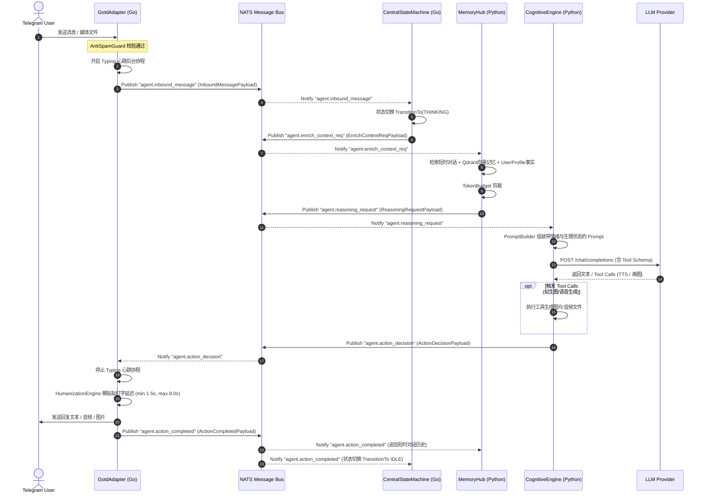
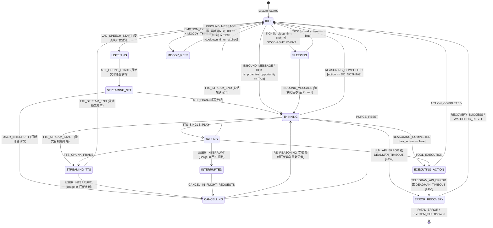
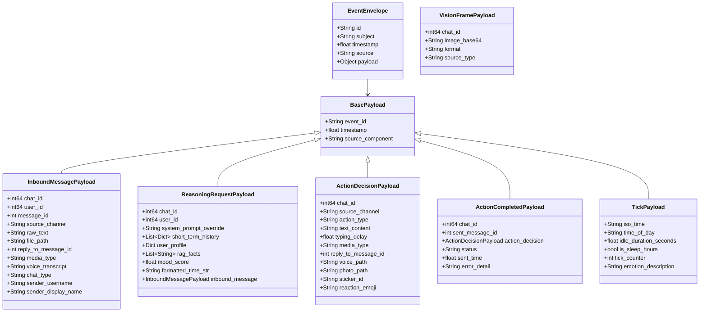
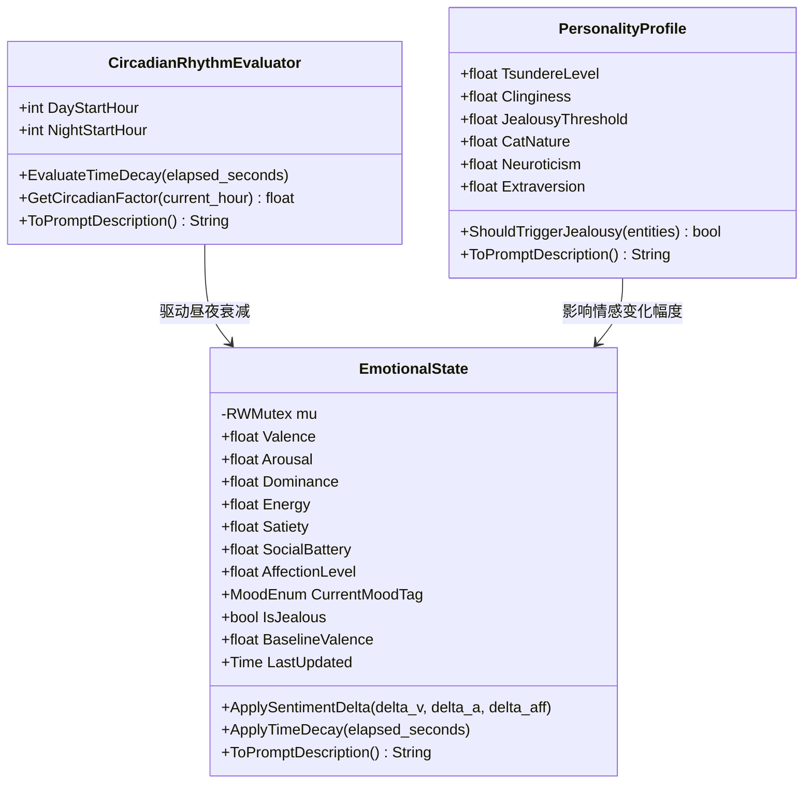

# BetterAgent (猫娘 Agent) 系统架构与 SRS 规范

本文档为 `BetterAgent` 项目的文本化架构规范与系统需求说明书（SRS）。所有图纸均使用 **Mermaid** 格式描述，可以直接进行 Git 版本控制与 AI Agent 语义解析，防止设计资产“文档腐化”。

---

## 1. 系统总体拓扑架构 (System Topology & Microservices)

针对生产环境的高并发网络 IO 与复杂 LLM 推理需求，系统采用 **Go Core (高性能控制核) + NATS (中枢消息总线) + Python Services (认知与记忆微服务)** 的异构架构。

---

## 2. 消息处理与推理时序 (Sequence Diagram)

用户在 Telegram 发送消息后，Go Core、NATS、Memory Service 与 Cognitive Service 之间的完整异步 Pub/Sub 交互时序：

---

## 3. 按 Chat 隔离状态机 (Per-Chat State Machine & Watchdog)

系统由 Go 实现的 `PerChatStateMachineManager` (`CentralStateMachine`) 掌控，通过 `map[int64]*ChatStateMachine` + `sync.RWMutex` 实现按 Telegram `chatID` 严格的并发隔离与状态生命周期管理，并配备 **Deadman Switch Watchdog（超时自愈死人开关）**：

---

## 4. NATS 总线与 Payload 强类型 Schema (Payload Schemas)

数据契约通过 NATS EventEnvelope 进行跨语言传输。Go 侧将 Telegram ID 严格限制为 `int64`。

### 4.1 NATS 点号分级规范 (Subject Hierarchy)

| 领域分类 | NATS Subject | 说明 |
| :--- | :--- | :--- |
| **基础中枢** | `agent.tick` / `agent.inbound_message` / `agent.error` | 系统心跳 / 上行消息 / 错误告警 |
| **记忆与推理** | `agent.enrich_context_req` / `agent.reasoning_request` | 记忆检索请求 / LLM 推理触发 |
| **决策与执行** | `agent.action_decision` / `agent.action_completed` | 行动决策下发 / 行动完成确认 |
| **VAD 听觉** | `agent.speech.start` / `agent.speech.end` | 麦克风开始/结束说话 |
| **打断撤销** | `agent.user.interrupt` / `agent.stream.cancel_req` | 用户打断 (Barge-in) 撤销 |
| **数字人流** | `agent.audio.chunk` / `agent.viseme.data` / `agent.tts.stream_chunk` | TTS 音频切片 / Viseme 口型 |
| **流式控制** | `agent.stt.stream_chunk` / `agent.stt.stream_final` / `agent.tts.stream_end` | STT 转写流 / TTS 结束 |
| **流式状态** | `agent.stream.cancel_ack` / `agent.stream.state_change` | 流式撤销确认 / 状态变更广播 |
| **视觉与感知** | `agent.vision.frame` / `agent.emotion.update` | 画面快照 / 情绪动作更新 |

### 4.2 Payload 类图 (Class Diagram)

---

## 5. 猫娘“情感与生理”机制 (Affective Computing Engine)

驻留在 Go Core 内部的极速心理与生理计算模型：

---

## 6. 防腐化策略 (Documentation Maintenance Rules)

为了保持设计资产永不过期，开发过程中须遵循以下原则：

1. **单一点真相 (Single Source of Truth)**：任何对 `core/internal/schema/payloads.go` 或状态机 `state_machine.go` 的修改，必须同步更新本文件中的 Mermaid 图纸。
2. **Git Hook 校验**：合并 PR 时检测 `docs/ARCHITECTURE.md` 是否同步变更。
3. **AI Prompt 提示**：在向抗重力 Agent 发出架构重构指令时，附带本文件（`docs/ARCHITECTURE.md`）作为上下文基准。
