# BetterAgent (猫娘 Agent) 系统架构与 SRS 规范

本文档为 `BetterAgent` 项目的文本化架构规范与系统需求说明书（SRS）。所有图纸均使用 **Mermaid** 格式描述，可以直接进行 Git 版本控制与 AI Agent 语义解析，防止设计资产“文档腐化”。

> 各组件间的鉴权机制、信任边界与部署前检查清单见配套文档 [SECURITY.md](./SECURITY.md)。图中标注的 NATS / WebGateway 等通道均已要求鉴权，细节以该文档为准。

---

## 1. 系统总体拓扑架构 (System Topology & Microservices)

针对生产环境的高并发网络 IO 与复杂 LLM 推理需求，系统采用 **Go Core (高性能控制核) + NATS (中枢消息总线) + Python Services (认知与记忆微服务) + Team Microservices (团队隔离外包/拓展微服务)** 的异构架构。

```mermaid
graph TD
    subgraph External_Adapters["External IO Networks / Clients / Games"]
        TG["Telegram Cloud API"]
        WebClient["Browser Client (stage-web / Live2D / VRM / 端口 5173)"]
        STS2Game["Slay the Spire 2 Game (C# Mod)"]
    end

    subgraph Go_Core["Go Core (betteragent-core)"]
        GotdAdapter["GotdAdapter (MTProto IO / typing心跳 / 媒体收发)"]
        WebGateway["WebGateway (WebSocket 网关 / 全双工事件桥接 / 端口 8080)"]
        AntiSpam["AntiSpamGuard (令牌桶全局/Peer限流)"]
        HumanEngine["HumanizationEngine (拟人打字延迟模拟)"]
        CSM["CentralStateMachine (中央状态机: IDLE/THINKING/SLEEPING...)"]
        ClockEngine["ClockEngine (TICK 定时心跳)"]
        EmotionEngine["EmotionEngine (VAD 3D情绪模型 & 生理指标)"]
        CircadianEvaluator["CircadianRhythm (昼夜生物钟评估器)"]
        UrgeEngine["UrgeEngine (欲望/枯燥度累加器 & 主动开口决策)"]
        GameEventIngest["GameEventHandler / GameStateHandler (HTTP:8090 / WS)"]
        GoNatsBus["NatsBus Client (Go)"]

        GotdAdapter --> AntiSpam
        GotdAdapter --> HumanEngine
        ClockEngine --> CircadianEvaluator
        CircadianEvaluator --> EmotionEngine
        EmotionEngine --> UrgeEngine
        UrgeEngine --> CSM
        GameEventIngest --> UrgeEngine
        GameEventIngest --> GoNatsBus
        EmotionEngine --> CSM
        CSM --> GoNatsBus
        GotdAdapter --> GoNatsBus
        WebGateway --> GoNatsBus
    end

    subgraph Message_Broker["Message Infrastructure"]
        NATS["NATS Server (Pub/Sub + JetStream / 端口 4222)"]
    end

    subgraph Core_Python_Services["Core Python Services Layer"]
        PyNatsBus["NatsBus Client (Python)"]
        
        subgraph Cognitive_Service["Cognitive Service (端口 8091 TTS / 8092 STT)"]
            CognitiveEngine["CognitiveEngine (推理逻辑)"]
            PromptBuilder["PromptBuilder (System Prompt组装)"]
            ToolRegistry["ToolRegistry (Tools / MCP / RAG / Game Action)"]
            LLMProvider["BaseLLMProvider (Gemini / Claude / OpenAI)"]

            CognitiveEngine --> PromptBuilder
            CognitiveEngine --> ToolRegistry
            CognitiveEngine --> LLMProvider
        end

        subgraph Memory_Service["Memory Service"]
            MemoryHub["MemoryHub (记忆编排)"]
            ShortTermBuffer["ShortTermBuffer (Redis短时缓存)"]
            VectorStore["VectorMemoryStore (Qdrant向量检索)"]
            UserProfile["UserProfileManager (用户事实画像)"]
            Consolidator["MemoryConsolidator (艾宾浩斯遗忘/记忆归档)"]
            TokenBudget["TokenBudgetManager (上下文 Token 剪裁)"]

            MemoryHub --> ShortTermBuffer
            MemoryHub --> VectorStore
            MemoryHub --> UserProfile
            MemoryHub --> Consolidator
            MemoryHub --> TokenBudget
        end

        subgraph Game_Watcher_Service["Game Watcher Service"]
            STS2Poller["STS2 Poller (轮询 C# Mod 状态并触发 Game Turn)"]
        end

        PyNatsBus --> CognitiveEngine
        PyNatsBus --> MemoryHub
        STS2Poller --> GoNatsBus
    end

    subgraph Team_Microservices["Team Isolated Microservices (API Contract Managed)"]
        CampusKB["Campus KB RAG Service (冯文哲 / HTTP:8093)"]
        AdminPanel["Admin Panel Service (谢自立 / REST:8094 & Web:8095)"]
        CompanionService["Companion Tool Service (张劭哲 / HTTP:8096 & SQLite)"]
    end

    TG <--> GotdAdapter
    WebClient <-->|"WebSocket (全双工)"| WebGateway
    STS2Game <-->|"HTTP:8090 / C# Mod"| GameEventIngest
    STS2Game <-->|"HTTP / Game Tool Calls"| ToolRegistry
    
    GoNatsBus <--> NATS
    PyNatsBus <--> NATS

    ToolRegistry --"HTTP POST /api/kb/search"--> CampusKB
    AdminPanel --"HTTP Proxy /api/kb/*"--> CampusKB
    AdminPanel --"PATCH Persona YAML"--> Core_Python_Services
    CompanionService --"POST Stat & Reminder Trigger"--> Go_Core
```

---

## 2. 消息处理与推理时序 (Sequence Diagrams)

### 2.1 Web 前端全双工数字人流式交互时序 (WebGateway & Digital Human Audio/Viseme, 核心主路线)

网页前端（`stage-web`）通过 WebSocket (`:8080`) 连接 `WebGateway`，实现**音视频切片流、Live2D Viseme 口型同步、流式状态机与双工多模态交互**：

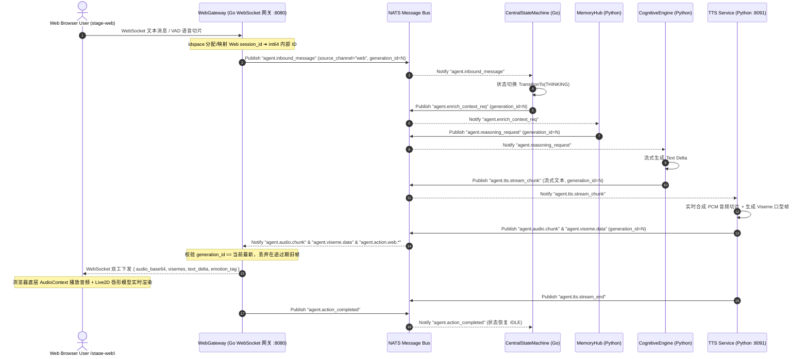

### 2.2 Barge-in 用户打断撤销时序 (Realtime Stream Cancel & Generation Increment)

当数字人正在说话/播放音频时，用户说话或在界面点击“打断”，系统毫秒级撤销在途推理，并**递增 generation_id 清空过期队列**：

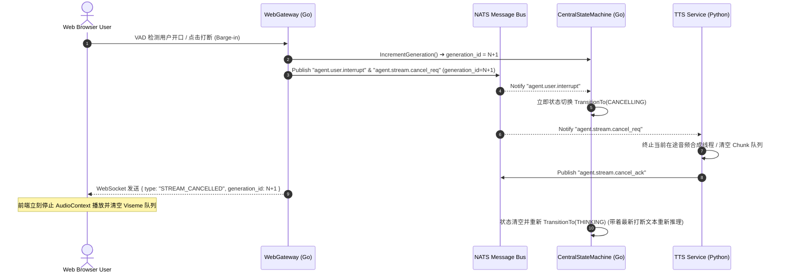

### 2.3 Telegram 消息处理时序 (Gotd Adapter, 二级异步扩展通道)

用户在 Telegram 发送消息后，Go Core、NATS、Memory Service 与 Cognitive Service 之间的完整 Pub/Sub 交互时序：

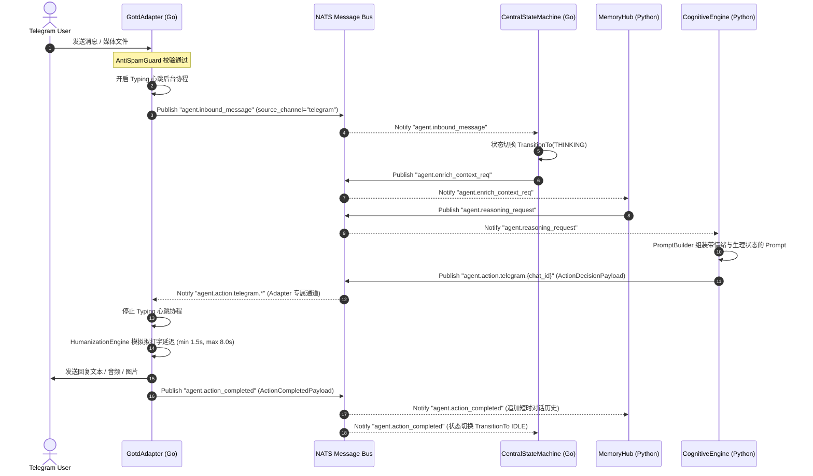

---

## 3. 多维会话隔离与代际控制状态机 (Multi-Session Generation State Machine & Watchdog)

系统由 Go Core 实现的 `CentralStateMachine` 掌控，通过 `map[int64]*ChatStateMachine` + `sync.RWMutex` 实现多维度会话隔离与状态生命周期管理，并配备 **Generation ID (代际防死锁与碰撞)** 与 **Deadman Switch Watchdog (超时自愈死人开关)**：

### 3.1 会话隔离与代际控制 (Idspace & Generation Guard)
1. **多渠道 ID 空间 (`idspace`)**：Telegram `chat_id` 与 Web 网关 WebSocket `session_id` 均统一映射为 int64 会话空间，避免 Channel 间会话混淆。
2. **原子代际计数器 (`generation_id`)**：每一轮新消息或 Barge-in 打断触发时，`generation_id` 原性自增。网络网关与消费端校验帧的 `generation_id`，自动滤除在途网络延迟导致的旧代际帧碰撞。
3. **2小时 TTL 自动回收 (`ChatStateInactivityTTL`)**：`IDLE` 状态空闲会话 2 小时后自动从内存中 Evict 释放，防止临时 WebSession 造成内存泄漏。

### 3.2 状态机迁移规范 (State Transition Matrix)

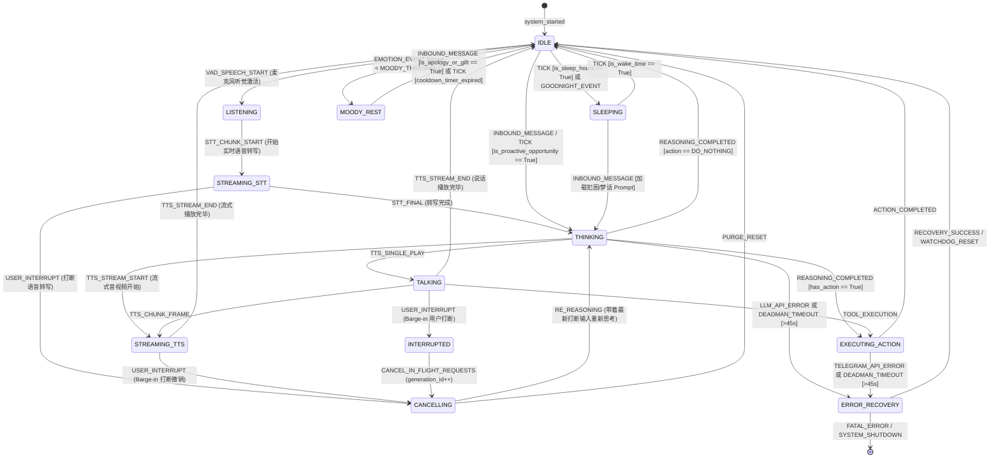

---

## 4. NATS 总线与 Payload 强类型 Schema (Payload Schemas)

数据契约通过 NATS EventEnvelope 进行跨语言传输。Go 侧将 Telegram ID 严格限制为 `int64`。

### 4.1 NATS 点号分级规范 (Subject Hierarchy)

| 领域分类 | NATS Subject | 说明 |
| :--- | :--- | :--- |
| **基础中枢** | `agent.tick` / `agent.inbound_message` / `agent.error` | 系统心跳 / 上行消息 / 错误告警 |
| **记忆与推理** | `agent.enrich_context_req` / `agent.reasoning_request` | 记忆检索请求 / LLM 推理触发 |
| **决策与执行** | `agent.action.{channel}.{chat_id}` / `agent.action_completed` | 行动决策下发（按渠道分级路由，如 `agent.action.web.1001` / `agent.action.telegram.56789`，各渠道适配器只订阅自己的通配符，NATS 在总线层面完成路由，不再靠 payload 里的 `source_channel` 字段各自过滤）/ 行动完成确认（不分渠道，供 Memory 服务统一记录对话历史） |
| **VAD 听觉** | `agent.speech.start` / `agent.speech.end` | 麦克风开始/结束说话 |
| **打断撤销** | `agent.user.interrupt` / `agent.stream.cancel_req` | 用户打断 (Barge-in) 撤销 |
| **数字人流** | `agent.audio.chunk` / `agent.viseme.data` / `agent.tts.stream_chunk` | TTS 音频切片 / Viseme 口型 |
| **流式控制** | `agent.stt.stream_chunk` / `agent.stt.stream_final` / `agent.tts.stream_end` | STT 转写流 / TTS 结束 |
| **流式状态** | `agent.stream.cancel_ack` / `agent.stream.state_change` | 流式撤销确认 / 状态变更广播 |
| **视觉与感知** | `agent.vision.frame` / `agent.emotion.update` / `agent.emotion.delta` | 画面快照 / 情绪动作更新 / 动态情绪增量回传 (Cognitive -> Go) |
| **人设与配置** | `agent.persona.update` | 人设热更新广播（YAML 磁盘同步 + PersonaLoader 内存缓存失效） |
| **游戏感知** | `agent.game_event` | 外部游戏事件广播（稀有圣物、濒死、胜负结算等） |

### 4.2 系统核心组件 UML 类图 (Core Components Class Diagram)

架构基于统一事件驱动基类 `BaseAgentComponent`，组件包括 **WebSocket 全双工网关 (`WebGateway`)**、Telegram 适配器 (`TelegramAdapter`)、中央状态机 (`CentralStateMachine`)、认知引擎 (`CognitiveEngine`)、记忆中心 (`MemoryHub`) 与心跳发生器 (`ClockEngine`)：

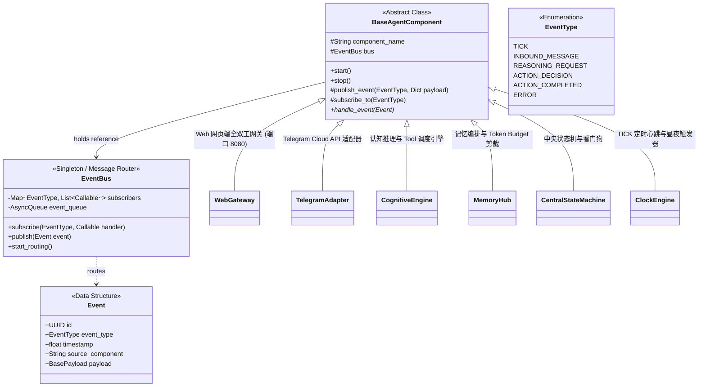

### 4.3 Payload 数据结构类图 (Payload Schemas)

```mermaid
classDiagram
    class EventEnvelope {
        +String id
        +String subject
        +float timestamp
        +String source
        +Object payload
    }

    class BasePayload {
        +String event_id
        +float timestamp
        +String source_component
    }

    class InboundMessagePayload {
        +int64 chat_id
        +int64 user_id
        +int generation_id
        +int message_id
        +String source_channel
        +String raw_text
        +String file_path
        +String media_type
        +String voice_transcript
    }

    class EnrichContextReqPayload {
        +int64 chat_id
        +int64 user_id
        +int generation_id
        +InboundMessagePayload inbound_message
        +String current_state
        +String trigger_type
        +String emotion_description
        +String source_channel
    }

    class ReasoningRequestPayload {
        +int64 chat_id
        +int64 user_id
        +int generation_id
        +List~Dict~ short_term_history
        +Dict user_profile
        +List~String~ rag_facts
        +String current_emotion
        +String personality_description
        +String circadian_description
        +float mood_score
        +InboundMessagePayload inbound_message
    }

    class EmotionDeltaPayload {
        +int64 chat_id
        +float delta_valence
        +float delta_arousal
        +float delta_affection
        +bool is_jealous
    }

    class StreamChunkPayload {
        +int64 chat_id
        +int generation_id
        +int chunk_index
        +bool is_final
        +String source_channel
        +String text_delta
        +String audio_base64
        +List~Dict~ visemes
        +bool is_sentence_start
    }

    class STTTranscriptPayload {
        +int64 chat_id
        +int generation_id
        +String text
        +String source_channel
    }

    class StreamCancelPayload {
        +int64 chat_id
        +int generation_id
        +String reason
        +String source_channel
    }

    class ActionDecisionPayload {
        +int64 chat_id
        +int generation_id
        +String source_channel
        +String action_type
        +String text_content
        +float typing_delay
        +String voice_path
        +String photo_path
        +bool is_final
    }

    class ActionCompletedPayload {
        +int64 chat_id
        +int sent_message_id
        +ActionDecisionPayload action_decision
        +String status
        +float sent_time
    }

    class GameEventPayload {
        +String game
        +String event_type
        +float weight
        +String detail
        +Dict metadata
    }

    class TickPayload {
        +String iso_time
        +String time_of_day
        +float idle_duration_seconds
        +bool is_sleep_hours
        +int tick_counter
    }

    EventEnvelope --> BasePayload
    BasePayload <|-- InboundMessagePayload
    BasePayload <|-- EnrichContextReqPayload
    BasePayload <|-- ReasoningRequestPayload
    BasePayload <|-- StreamChunkPayload
    BasePayload <|-- STTTranscriptPayload
    BasePayload <|-- StreamCancelPayload
    BasePayload <|-- ActionDecisionPayload
    BasePayload <|-- ActionCompletedPayload
    BasePayload <|-- GameEventPayload
    BasePayload <|-- TickPayload
```

---

## 5. 猫娘“情感与生理”机制 (Affective Computing Engine)

驻留在 Go Core 内部的多 ChatID 隔离心理与生理计算模型，支持多路并发快照隔离与原子落盘自愈机制：

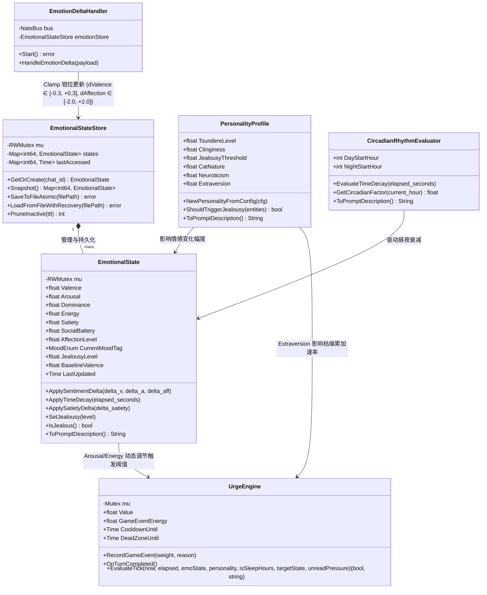

---

## 6. 多渠道适配器扩展规范与 Better Agent 前端架构

### 6.1 多渠道适配器扩展规范 (Multi-Channel Adapter Pattern)

基于 `BaseAgentComponent` 抽象基类与 NATS 按渠道分级的 Subject 路由机制 (`agent.action.{channel}.{chat_id}`)，新增任意第三方网络 IO 渠道（如 Discord / WhatsApp / QQ Bot）只需实现一个继承类：

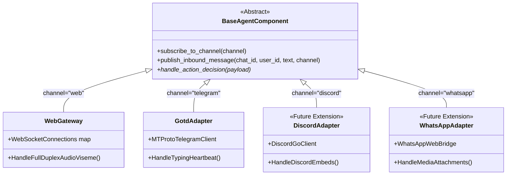

* **统一路由控制**：所有适配器仅需向 NATS 发布 `agent.inbound_message` 并附带自身的 `source_channel`（如 `"web"` / `"telegram"` / `"discord"`）。
* **隔离监听**：适配器仅订阅 `agent.action.{channel}.*` 主题，保证各渠道消息下发相互隔离，无需在 Payload 内部手写条件过滤。

---

### 6.2 Better Agent 前端数字人渲染与状态控制架构 (Better Agent Frontend Pipeline)

前端采用 Vue 3 + Vite + Pinia + UnoCSS 构筑（`frontend/apps/stage-web` 与 `@proj-airi/stage-ui`），实现了渲染层与网络状态解耦的响应式管道：

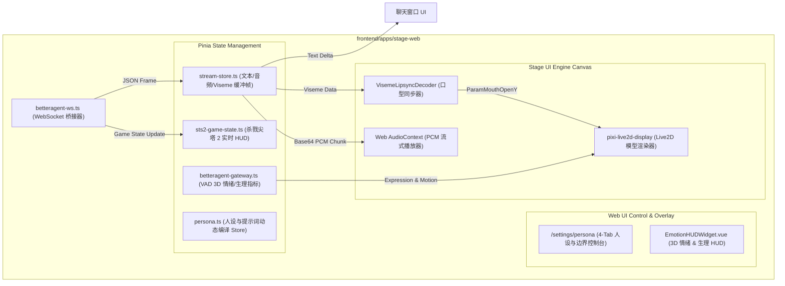

WebGateway 下行 JSON 帧还包括 `agent.stt_transcript`（`{ text, is_final, chat_id }`），
用于把 `agent.stt.stream_final` 识别结果回显给前端，让语音输入在聊天窗口中显示为普通用户消息；
STT 识别本身仍通过 `agent.inbound_message` 进入同一推理链路。

---

## 7. 团队 Python 微服务扩展矩阵 (Python Microservice Subsystem)

为了在大型项目中保证跨组员协作互不干扰，Python 服务层拆分为**核心认知与记忆引擎**与**团队独立微服务**：

| 微服务名称 | 目录路径 | 监听端口 | 负责人 | 状态 | 核心路由 / 职责 |
| :--- | :--- | :--- | :--- | :--- | :--- |
| **Cognitive Service** | `services/cognitive/` | `:8091` / `:8092` | 核心 / 褚裕禄 | ✅ 就绪 | LLM 推理、Tool 调度、TTS/STT 流式生成 |
| **Memory Service** | `services/memory/` | — (Redis/Qdrant) | 核心 / 褚裕禄 | ✅ 就绪 | Redis 短时缓存、Qdrant 向量检索、UserProfile 画像 |
| **Game Watcher Service**| `services/game_watcher/`| — (Polling) | 核心 / 褚裕禄 | ✅ 就绪 | Slay the Spire 2 游戏轮询与自动回合触发 |
| **Campus KB Service** | `services/campus_kb/` | `:8093` (HTTP) | 冯文哲 | ✅ 就绪 | `POST /api/kb/ingest`（向量入库）、`POST /api/kb/search`（语义检索） |
| **Admin Backend** | `admin/backend/` | `:8094` (REST) | 谢自立 | ✅ 就绪 | 人设 CRUD、用户管理、会话查看、记忆管理、日程/KB 代理、Config PATCH（共 27 路由） |
| **Admin Frontend** | `admin/frontend/` | `:8095` (Web Dev)| 谢自立 | ✅ 就绪 | Vue 3 + Element Plus 独立后台管理界面（`dist/` 已构建） |
| **Companion Service** | `services/companion/` | `:8096` (HTTP) | 张劭哲 | ✅ 就绪 | 日程 CRUD、`POST /api/companion/query`（NL2SQL）、`GET /api/companion/recommendations`（任务推荐） |

### 7.1 Campus KB 校园知识库交互数据流 (Campus KB RAG Flow)

猫娘（BetterAgent）与校园知识库 `services/campus_kb` 的交互采用**预注入 RAG 上下文**与**自主 Tool Calling**双通道机制：

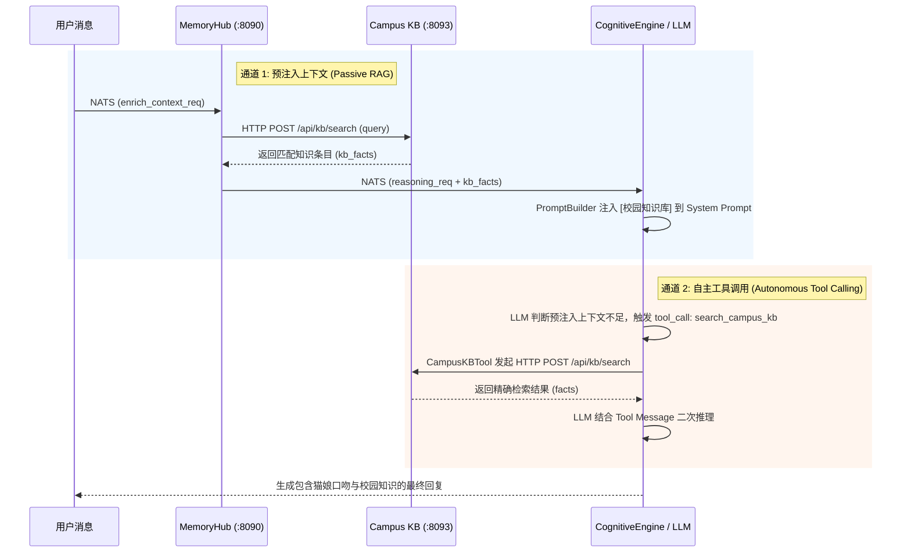

---

## 8. Admin Panel 操作时序 (Admin Panel Interaction Sequence)

B 端管理控制台（`admin/frontend/` → `admin/backend/:8094`）与核心存储层的交互时序，覆盖人设 PATCH 热重载、会话查看与知识库管理三条关键路径：

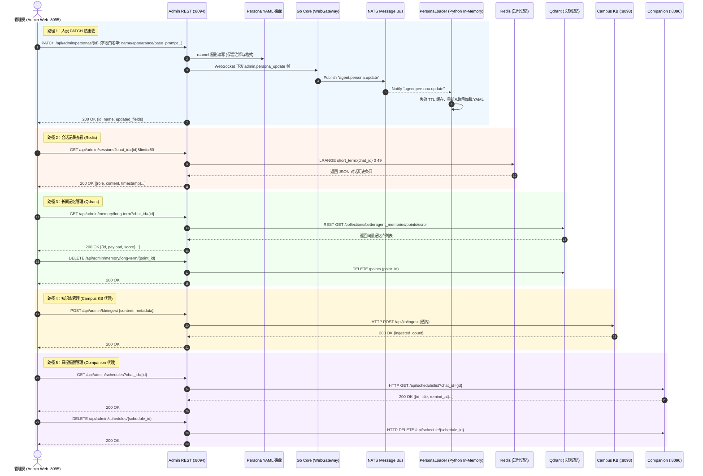

---

## 9. 防腐化策略 (Documentation Maintenance Rules)

为了保持设计资产永不过期，开发过程中须遵循以下原则：

1. **单一点真相 (Single Source of Truth)**：任何对 `core/internal/schema/payloads.go` 或状态机 `state_machine.go` 的修改，必须同步更新本文件中的 Mermaid 图纸。
2. **Git Hook 校验**：合并 PR 时检测 `docs/ARCHITECTURE.md` 是否同步变更。
3. **AI Prompt 提示**：在向抗重力 Agent 发出架构重构指令时，附带本文件（`docs/ARCHITECTURE.md`）作为上下文基准。
