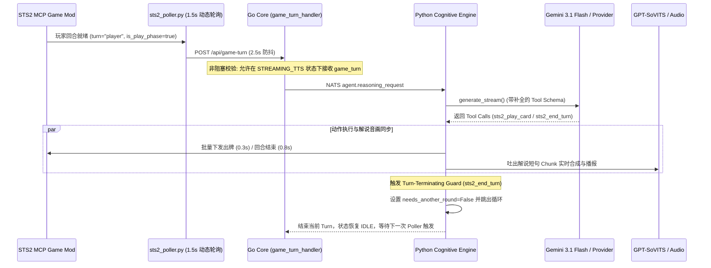

# Master Implementation Plan - STS2 Autonomous Gameplay Smoothness, Gemini Fixes & Commentary Sync

## 概述 (Overview)

本方案整合了对 **GeminiProvider 原生函数调用**、**Cognitive Engine 20 轮死循环修复**、**Go Core 状态机 TTS 非阻塞解耦** 以及 **《杀戮尖塔2》操作与解说实时音画同步** 的完整架构优化。

优化目标：彻底消除打牌卡顿与死循环，实现每 1.5~2.0s 高频顺畅打牌，并保持猫娘解说的音画同步。

---

## 架构时序图 (Architecture & Sequence Diagram)



---

## 关键诊断发现与根因 (Key Diagnostic Findings & Root Causes)

> [!IMPORTANT]
> **根因 1：`stream_reasoning_loop` 缺乏回合结束中断 (Turn-Terminating Break)**
> - **问题现象**：`stream_reasoning_loop hit its round budget (20, trigger_type='game_turn') ...`
> - **运行机制**：模型调用 `sts2_end_turn` 后，Mod 执行回合结束。由于 `cognitive_engine` 未断开循环，在第 $N+1$ 轮继续发请求。Gemini 查到 `turn == "enemy"` 后无法操作，只能重复调用 `sts2_get_game_state` 刷状态，直至撞上 20 轮上限。
> - **修复方案**：检测到 `STS2_TURN_TERMINATING_TOOLS`（`sts2_end_turn`, `sts2_choose_map_node` 等）时，设置 `needs_another_round = False` 并在吐出总结文本后立即跳出循环。

> [!IMPORTANT]
> **根因 2：Go Core CSM 状态机 TTS 独占锁阻塞游戏回合**
> - **问题现象**：每轮打牌之间间隔长达 35s~70s。
> - **运行机制**：在猫娘播报上一句解说（`STREAMING_TTS`）期间，`game_turn_handler.go` 拒绝所有新 `game_turn`（返回 `status: "busy"`）。
> - **修复方案**：放宽 Go Core 校验，允许在 `STREAMING_TTS` / `StateTalking` 状态下并行接收 `game_turn` 请求，让出牌动作与语音解说并发流水线化。

> [!WARNING]
> **根因 3：Gemini SDK `types.Part` 参数与 Schema 兼容漏洞**
> - `types.Part(..., thought_signature=thought_sig)` 传入 `None` 会触发 SDK Pydantic 校验错误。
> - `_build_function_declarations()` 中 `required=[]`（空列表）会导致部分 Gemini 模型 API 报 400 Bad Request。

> [!NOTE]
> **根因 4：工具名规范化与手牌重排序 `STS2_INDEX_SHIFT_FIELDS` 脱节**
> - `STS2_INDEX_SHIFT_FIELDS` 原仅包含 `"sts2_play_card"`。当 Provider 返回无前缀 `"play_card"` 时，出牌高索引优先重排序被跳过，可能导致批量出牌顺序错乱。

---

## 拟修改模块与细节 (Proposed Changes)

### 组件 1：Go Core 状态机与 WebGateway (`core/`)

#### [MODIFY] [game_turn_handler.go](file:///d:/projects/BetterAgent/core/internal/webgateway/game_turn_handler.go)
- 放宽 `handleGameTurn` 忙碌检查：仅当状态为 `StateThinking` 或 `StateExecutingAction` 时返回 `status: "busy"`；若处于 `StateStreamingTTS` 或 `StateTalking`，允许接收 `game_turn` 请求。

#### [MODIFY] [state_machine.go](file:///d:/projects/BetterAgent/core/internal/engine/state_machine.go)
- 在 `IsValidTransition` 中增加允许 `StateStreamingTTS -> StateThinking` 和 `StateTalking -> StateThinking` 状态迁移。

---

### 组件 2：Cognitive Engine & Gemini Provider (`services/cognitive/`)

#### [MODIFY] [cognitive_engine.py](file:///d:/projects/BetterAgent/services/cognitive/cognitive_engine.py)
- **回合终止动作 Guard**：定义 `STS2_TURN_TERMINATING_TOOLS = {"sts2_end_turn", "end_turn", "sts2_choose_map_node", "choose_map_node"}`。当工具调用包含其中之一时，置 `needs_another_round = False`。
- **工具名重排序兼容**：`STS2_INDEX_SHIFT_FIELDS` 同时支持 `"sts2_play_card"`, `"play_card"`, `"sts2_claim_reward"`, `"claim_reward"`, `"sts2_select_card_reward"`, `"select_card_reward"`。

#### [MODIFY] [gemini_provider.py](file:///d:/projects/BetterAgent/services/cognitive/providers/gemini_provider.py)
- **动态 `types.Part` 构造**：仅在 `thought_sig is not None` 时才向 `types.Part` 传递 `thought_signature` 参数。
- **Schema `required` 净化**：在 `_build_function_declarations()` 中仅在 `bool(req_fields)` 为真时传递 `required` 属性。

---

### 组件 3：Game Watcher 频次与动作缓冲 (`services/game_watcher/` & `config/`)

#### [MODIFY] [sts2_poller.py](file:///d:/projects/BetterAgent/services/game_watcher/sts2_poller.py)
- 战斗场景（`COMBAT_STATE_TYPES`）动态启用 `1.5s` 高频轮询；静态场景使用 `3.0s`。
- `last_turn_time` 触发防抖由 `8.0s` 缩短至 `2.5s`。

#### [MODIFY] [sts2_http_client.py](file:///d:/projects/BetterAgent/services/cognitive/tools/sts2_http_client.py)
- 普通出牌 `action_delay_seconds` 由 `0.6s` 优化至 `0.3s`；`end_turn` 设为 `0.8s` 以保证 Godot UI 节点树动画平滑过渡。

#### [MODIFY] [config.yaml](file:///d:/projects/BetterAgent/config/config.yaml)
- 配置项 `poll_interval_seconds: 1.5`, `action_delay_seconds: 0.3`。

---

### 组件 4：测试套件 (`tests/`)

#### [MODIFY] [test_gemini_provider.py](file:///d:/projects/BetterAgent/tests/test_gemini_provider.py)
- 增加对 `GeminiProvider` 消息转换及 Schema 构建的单元测试。
- 验证 `_reorder_index_shifting_calls` 对 `sts2_play_card` 与 `play_card` 的重排序逻辑。
- 验证 `stream_reasoning_loop` 遇到 `sts2_end_turn` 后正常退出，不再触发 20 轮上限。

---

## 验证计划 (Verification Plan)

### 1. 自动化测试 (Automated Tests)
- 运行 Pytest 校验 Python 修复：
  ```powershell
  $env:PYTHONPATH="."; .\.venv\Scripts\pytest tests/ -k gemini -v
  ```
- 运行 Go 测试校验状态机：
  ```powershell
  cd core; go test ./internal/webgateway/... ./internal/engine/...
  ```

### 2. 手动集成验证 (Manual Verification)
- 启动全套服务 (`python runner.py`)。
- 在前端 Web UI 开启托管 (`/game_start`)。
- 观察 `logs/cognitive_service.log` 与 `logs/betteragent_core_stdout.log`，确认：
  1. 出牌与解说并发流畅，回合间停顿由 60s 降至 2s 左右；
  2. 无 `round budget (20)` 超限警告，`sts2_end_turn` 后干净退出；
  3. 音画无严重脱节。
